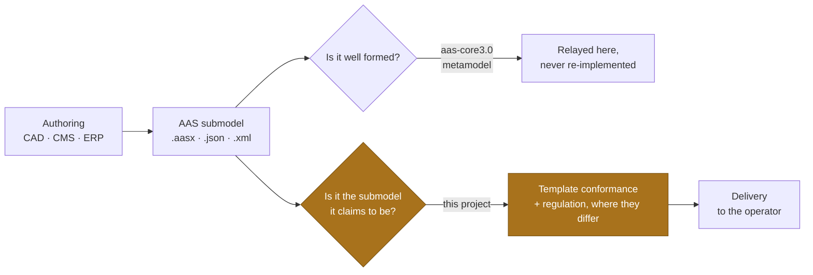
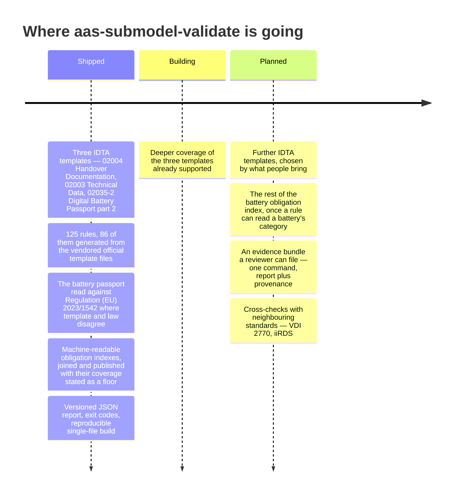

<div align="center">

  

[](https://github.com/dev365code/aas-submodel-validate/actions/workflows/ci.yml)
[](https://pypi.org/project/aas-submodel-validate/)
[](https://github.com/dev365code/aas-submodel-validate/blob/main/docs/scope.md)
[](https://github.com/dev365code/aas-submodel-validate/blob/main/LICENSE)

&nbsp;**Apache-2.0**&nbsp;·&nbsp;**Python 3.9–3.13**&nbsp;·&nbsp;**Linux · macOS · Windows**&nbsp;·&nbsp;**zero network, by design**

[Ten seconds](#ten-seconds) · [What it catches](#what-it-catches) · [Where it sits](#where-it-sits) · [Three doors](#three-doors-one-judgement) · [Honest coverage](#honest-coverage) · [Why trust the answer](#why-trust-the-answer) · [Roadmap](#roadmap) · [In your product](#using-this-validator-in-your-product)

</div>

## Ten seconds


```console
$ pip3 install aas-submodel-validate
$ smtv --example
```

**Every finding says what is wrong, where, and how to fix it — and shows the evidence where there is evidence to show.** A rule without a remedy sentence does not ship. On the bundled official example all 87 findings carry a place and a remedy, and 10 carry a `saw` line; the other 77 are relayed metamodel findings, which name a path and no value. Here is the one this project exists for — a battery passport that is *conformant to its template and not to the law*, which are two different questions and get two different answers:

```console
$ smtv --allow-unmatched --meta info your-battery-passport.json
warning BAT-R8   conformant to the template and not to the regulation: 'EnergyRoundTripEfficiencyFade' is absent
        at   EnergyRoundTripEfficiencyFade
        saw  IDTA 02035-4 V1.0.1 makes it ZeroToOne; Annex IV Part A (4) is read as requiring it, for every battery category the source names. Asked anywhere under the submodel: this rule is about the data being present, not about where the template puts it
        per  Regulation (EU) 2023/1542 Annex IV Part A (4); docs/divergences.md #37 for whose reading of it this answers
        fix: Provide the element, or record that this battery is outside the provision read as requiring it. The template will not ask for it -- that is the point of the finding.
…
0 error(s), 1 warning(s), 3 info -- your-battery-passport.json; judged 0 of 1 submodel
```

The `…` is three lines: the one that accounts for the `3 info` — the
relayed metamodel findings, folded into a count unless you ask for them
— and two notes, one of which is the coverage figure further down.
Notes are printed and not counted; the folded line is counted and not
printed in full. And the exit code is **0**: a disagreement with the
regulation is a warning, so it does not fail your build unless you ask
it to (`-W` makes a warning exit 1). That is deliberate. This tool answers for
the template; the law is somebody's reading of the law, and reading is
not a thing to fail a pipeline on without being told to.

> [!TIP]
> No install for a first try: `uvx --from aas-submodel-validate smtv --example` runs it in a throwaway environment.

The second command above needs no file of your own, no clone and no network: the example IDTA publishes travels in the wheel, under the same CC BY 4.0 licence as the templates beside it (see `NOTICE`). It is unmodified, defects and all — it raises findings, which is the point of shipping that one rather than a clean file written to pass. **A first verdict that says `ok` proves nothing about a validator.**

If `pip3` is not the spelling on your machine, `python3 -m pip install aas-submodel-validate` usually is — `py -m pip install aas-submodel-validate` on Windows. If `smtv` is then *command not found*, pip printed the directory it installed into — put that on your `PATH`, or run the tool as `python3 -m aas_submodel_validate`.

<details>
<summary>A second sample, generated by the test suite and stale-checked on every build</summary>

```text
error   SMT-D1   no submodel declares a semanticId this tool has a template table for
        saw  semanticId value(s): urn:somecompany:docs
        per  IDTA 02004-2-0 §2.4, Table 2; IDTA 02003-2-0-1 §2
        fix: If the submodel means one of the templates this tool has a table for, give it that template's semanticId: 0173-1#01-AHF578#003 for Handover Documentation (IDTA 02004); 0173-1#01-AHX837#002 for Technical Data (IDTA 02003). If it means a template this tool has no table for, leave the identifier alone -- it is doing its job, and this finding only says nothing here judged the submodel against a template.
1 error(s), 0 warning(s), 0 info -- machine-docs.json; judged 0 of 1 submodel
```

</details>

## What it catches

Five of the 125, in the words the tool actually prints:

| You ship this | `smtv` says |
|---|---|
| A `DocumentVersion` whose `StatusValue` is `released` | **HD-D6** · StatusValue is outside the vocabulary — `saw 'released'` |
| `ClassificationSystem` written `VDI2770:2020` | **HDL5** · ClassificationSystem spells the VDI system non-canonically |
| A `Document` with no VDI 2770 classification at all | **HD-D2** · no DocumentClassification declares the mandatory VDI 2770 classification system |
| A `ClassName` given only in German | **HD-D4** · ClassName has no English entry — `saw languages present: de` |
| A battery passport missing an element a published reading of the law requires | **BAT-R8** · conformant to the template and not to the regulation |

Each of those five carries an `at`, a `saw` where there is evidence to show, the clause it reads from, and a sentence saying what to change.

## Where it sits



A file can be perfectly valid against the AAS metamodel and still not be the submodel it claims to be: the wrong cardinalities, the wrong semantic identifiers, a mandatory VDI 2770 classification missing. **That gap is the whole of this project.** Metamodel checking is delegated to [aas-core3.0](https://github.com/aas-core-works/aas-core3.0-python) and reported in a separate channel, never re-invented here.

## Three doors, one judgement

| Door | For | Command |
|---|---|---|
| **Terminal** | a machine with pip | `pip3 install aas-submodel-validate` then `smtv file.aasx` |
| **Single file** | a machine with no package manager | carry `smtv.pyz`, run `python3 smtv.pyz file.aasx` (`py smtv.pyz file.aasx` on Windows) |
| **A build** | a pipeline that reads exit codes | `smtv -q -W file.aasx` — 0 pass, 1 findings, 2 could not run |

The same rules and the same verdict behind all three. There is no browser door and no hosted service; nothing here uploads a file anywhere, because nothing here opens a socket.

**For a machine with no package manager**, take `smtv.pyz` from the
[releases page](https://github.com/dev365code/aas-submodel-validate/releases/latest)
— built and checksummed there, and carrying build provenance you can
verify with `gh attestation verify` from 0.1.1 on — or build it yourself
from a
clone where there is a network, and carry it:

```sh
python3 tools/build_zipapp.py           # from a clone; or download it
python3 dist/smtv.pyz --example         # a verdict, with nothing else on the machine
python3 dist/smtv.pyz your-submodel.aasx
```

Everything is inside it — this package and its one dependency — and
nothing is compiled, so the same file runs on Linux, macOS and Windows,
and it is an ordinary zip anyone who has to approve it can open and
read. Two builds of one tree that resolve the same dependency version
are byte-identical, so the hash on a release page is the hash of the
file you carried in. The dependency is a range and not a pin, so a build
made after upstream publishes again is a different file — which is why
the release page's hash is the one to check against, and not one you
produce later.

## Honest coverage

A verdict says how much of your file a template answered for, and the
battery rules say how much of their own table they were able to answer
for. Neither number is decoration.

**One limit is worth knowing before you rely on a pass.** Matching goes
by semanticId, so an element whose identifier is wrong matches no row —
and the rules for everything *inside* it are rules about a row that was
never reached. Measured across the 86 generated rules: a single wrong
identifier turns twelve of them from a failing verdict into a passing
one, and thirty-three report nothing at all. The realistic cause is not
an attack but a version bump (`#002` to `#003`) or a typo in a
hand-edited file. The near-miss lint catches a version drift, which is
what it was built for, and catches nothing else. This is written up
with the measurement in
[docs/divergences.md](https://github.com/dev365code/aas-submodel-validate/blob/main/docs/divergences.md)
#23; closing it needs a rule this project does not have yet, and it is
on the roadmap rather than in this release. Here is that second one whole, as the
tool writes it — one line, unfolded:

```text
note    BAT-R8 reported 1 of the 9 elements this table holds; 8 of them need a battery category no rule here reads yet, so whether the law requires those is a question this run did not ask. Read from IDTA 02035-1 V1.0, IDTA 02035-4 V1.0.1, IDTA 02035-5 V1.0.2. Both figures are a floor, not a measurement: the templates cite no provision of the law, so the join behind the table matched attributes by name, and name matching misses every element whose label differs from the prose, and reaches a nested one only when its label happens to match.
```

> [!IMPORTANT]
> **This is not a certificate of compliance with Regulation (EU) 2023/1542.** Those nine rows are where an attribute name matched *and* the two readings disagree; the join behind them left 179 of 221 template elements matching nothing at all, and 63 of the Commission's 71 guidance data points finding no element. Reading a battery's category, deciding which applicability date applies, or concluding that a passport is lawful are all outside this tool. The indexes and the join are published in
> [`data/battery-passport/`](https://github.com/dev365code/aas-submodel-validate/tree/main/data/battery-passport)
> so the number can be argued with rather than taken.

A verdict that reached the rules says how many submodels a template
answered for — `judged 1 of 3 submodels`, or `no submodels to judge`
when the input held none. A submodel that declares itself a template is
a specification and not an instance, so it is set aside rather than
judged: the summary says how many were, a note names them, and
`--require-all-judged` does not ask for what cannot be given. An input that was refused carries no judged clause at
all — it says `(not a full verdict: some of it was not read)`, because
nothing was judged and a coverage figure about it would be an
invention. An environment carries submodels this tool has no business
judging, so an unjudged one is a number and not a finding;
`--require-all-judged` turns that number into an exit code when your
pipeline needs it to.

The number counts submodels a template table answered for, and nothing
else. Rules that need no template — the container checks, the battery
table — report on a submodel that the count still calls unjudged, which
is why a file can show `judged 0 of 1` and a finding in the same
breath.

## Why trust the answer

- **Every finding has a remedy.** A rule that cannot say what to change does not get registered; the suite refuses it.
- **It will not stay silent.** An input where nothing matches a template this tool has is an *error*, not a shrug — silence about a file it could not judge is the one answer a validator must never give.
- **It refuses rather than guesses.** A refused input exits 2, not 1: "could not run" and "ran and failed" are different sentences, and the report says which.
- **Offline, always.** No network call in any code path. The single-file build is an ordinary zip with no compiled artefacts — a reviewer can read every line of it before it crosses a threshold.
- **Deterministic.** Two builds of one tree produce the same bytes; two runs over one file produce the same report, ordered.
- **Every chosen reading is written down.** Where the published template and its own published example disagree — and they do — [docs/divergences.md](https://github.com/dev365code/aas-submodel-validate/blob/main/docs/divergences.md) records which reading this tool follows and the evidence for it.
- **A gate is not trusted here until it has been made to fail.** One that has never failed is one nobody has tested, and it is indistinguishable from one that cannot.

## Roadmap

An item moves right only when it is built and verified. These counts are
the registry's, and the suite fails when they drift from it; `smtv
--rules` lists the rules one per line and ends with the relayed
metamodel channel, so that listing is one line longer than the count.



## When aas-submodel-validate is not the tool

- **You need metamodel conformance.** That is [aas-core3.0](https://github.com/aas-core-works/aas-core3.0-python)'s job, and [aas-test-engines](https://github.com/admin-shell-io/aas-test-engines) is the official conformance tooling for the metamodel, serialisation, AASX packaging and APIs. As of v1.0.3 its submodel-template layer covers two templates (Contact Information, Digital Nameplate); this project is the complementary layer for the three it supports.
- **You need a file repaired.** There is no `--fix`. A validator that edits your file has to be trusted twice.
- **Your submodel is of a kind not listed above.** It will say so — clearly, and as an error — rather than pass it quietly.
- **You want a hosted check.** There is none, on purpose.

What it refuses to do is written down in [docs/scope.md](https://github.com/dev365code/aas-submodel-validate/blob/main/docs/scope.md).

## Putting it in a build

    smtv -q -W your-submodel.aasx        # 0 pass, 1 findings, 2 could not run

`-W` fails on every warning, including the ones relayed from
aas-core3.0 about the metamodel. Those are not always somebody else's
problem — on the official example, 45 of the 77 are about the submodel
itself, and most of those clear by deleting an idShort the metamodel
says should not be there — so they are
warnings like any other until you say otherwise:

    smtv -q -W --meta info your-submodel.aasx

`--meta` sets that channel's severity to `error`, `warning` (the
default) or `info`. At `info` it is still reported and still counted;
`-W` simply no longer fails on it. One dial, so there is no second flag
to disagree with the first.

Two more that decide exit codes, both for the case where the tool cannot
speak to your file:

- `--allow-unmatched` — an input where *nothing* declares a submodel
  identifier this tool has a table for is an *error* by default, because
  silence about a file it could not judge at all is the one answer a
  validator must never give. When that is expected — a repository where
  most submodels are of other kinds — this makes it a note instead. It
  says nothing about a file where some submodels matched and others did
  not; that is the next flag's question.
- `--require-all-judged` — an environment can hold submodels this tool
  has no business judging, so `judged 1 of 3` is a number rather than a
  finding and the run still exits 0. If your pipeline reads only the exit
  code, this makes partial coverage fail rather than pass quietly. It
  also covers the emptiest case: an input holding no submodels at all,
  which the summary reports as `no submodels to judge`. That one already
  fails by default — nothing matched, so `SMT-D1` is an error — and
  `--allow-unmatched` is what turns it into a pass. The two flags
  together say the thing neither says alone: an unmatched submodel is
  not an error, and it is not coverage either.

Reads `.aasx` (OPC containers, XML or JSON payload), AAS environment
`.json`/`.xml`, and bare Submodel `.json`. Exit codes: 0 nothing at error
severity, 1 at least one error, 2 could not run — which covers a path
that cannot be read and an input this reader refused, since nothing about
either was judged. Warnings do not fail a build unless you ask with
`-W`, and info never does. `-f json` writes a versioned
machine-readable report, described in
[docs/report-schema.md](https://github.com/dev365code/aas-submodel-validate/blob/main/docs/report-schema.md).

One dependency
([aas-core3.0](https://github.com/aas-core-works/aas-core3.0-python)),
pure Python, no C extensions. Both wheels fit on a USB stick and
install with `--no-index --find-links`; the single file above needs not
even that.

### Reading a finding

Four labelled lines under each one, and a finding uses the ones it has:

| | |
|---|---|
| `at` | where in the submodel — the path of idShorts down to the element |
| `saw` | what was actually there, so you can tell this finding from a similar one |
| `per` | the clause this reading comes from, for when you have to cite it |
| `fix` | what to change. Every finding has one; a finding without a remedy is a complaint |

Below them, one line per channel that was folded and then the summary.
The metamodel channel is folded by default — it is relayed from
aas-core3.0 rather than read off a template, and on the official example
it is 77 of 87 findings. Folded, not dropped: the summary still counts
them and `--show-meta` lists them. `-f json` is never folded.

The summary line says how many of each severity, then the file, then how
many of its submodels were judged. `(not a full verdict: some of it was
not read)` is appended when something was refused or would not parse —
which is a different thing from a file that was read and failed.

## What it checks

125 rules, 116 of them across three IDTA templates — 86 generated from the vendored
official template files (cardinality, element kinds, value types,
semantic identifiers at every nesting level), 30 hand-written where a
template file cannot speak. Of the nine that belong to no template,
five are about the input itself — how it is packaged, whether it parses,
and how much of it this reader will take in — and two are about whether
a template this tool knows applies, and which one. The last two read the
battery
passport against Regulation (EU) 2023/1542 rather than against a
template, over IDTA 02035-1, 02035-4 and 02035-5: one names a submodel
identifier that two published templates claim, and one reports an
element a template permits to be absent that a published legal reading
requires — a file can be conformant to the template and not to the law,
and those are different answers. It reports the one such disagreement
that does not depend on the battery's category; eight more are known,
counted in the report, and left unsaid because saying them without the
category would tell one manufacturer to add what another's guidance
forbids. Most of a battery passport is submodels this tool has no table
for; the exception is part 2, which declares 02004's identifier and so
is judged. A package holding part 2 comes back with a verdict. One
holding only the other parts draws `SMT-D1` and exits 1 — "nothing here
matched a template I have", which is true and is not a defect in the
file. `--allow-unmatched` is for that. X1, X2 and X4 are about the AASX/OPC
package the submodel arrives in; X3 says a document would not parse,
packaged or bare; and X5 is this reader's own bound on how much it will
take in, whichever way it arrives. One, SMT-D1, asks whether
the input brought a submodel this tool knows at all; and one, SMT-D2,
says which template answered wherever two published templates share one
submodel identifier and something had to choose.

| template | generated | hand-written |
|---|---|---|
| IDTA 02004 Handover Documentation 2.0.1 | 38 | the mandatory VDI 2770 classification and its twelve classes, English class names, the status vocabulary, dates that are dates, files that exist in the container, references that resolve |
| IDTA 02003 Technical Data 2.0.1 | 26 | dates that are dates, files that exist in the container, references that resolve |
| IDTA 02035-2 Digital Battery Passport part 2 1.0 | 22 | 02004's, minus the three whose elements this template drops |

02003 declares open content: §3.5 says the set of suitable semanticIds
is not restricted, so its 36 placeholder elements generate no rules and
a manufacturer's own properties pass without complaint. Near-miss
identifiers are diagnosed rather than silently unmatched, in all three.

IDTA 02035-2 (*Digital Battery Passport*, part 2) publishes IDTA 02004's
submodel identifier and asks for less than it does, so which of the two
answers has to be chosen. Today that choice is the caller's:
`--profile 02035-2` judges by the battery passport's table,
`--profile 02004` by the Handover template's, and without the flag 02004
answers as it always has. Whenever a file declares the profile or the
flag is used, the report says which template answered and counts the
checks the two disagree about — what this run asked that the other would
not, or what it did not ask that the other would (SMT-D2). Without the flag, a plain
02004 file draws nothing here, because nothing had to choose; ask for
`--profile 02004` and SMT-D2 says so at info, because then something
did.

Beside the validator, `data/battery-passport/` publishes machine-readable
indexes of what a battery passport is required to carry -- Annex XIII of
Regulation (EU) 2023/1542, the Commission's data-point guidance, the
Battery Pass long list, and the IDTA 02035/02099 templates -- with a
join across all four whose coverage is stated as a floor. The sources
are pinned by hash, not mirrored; `data/battery-passport/README.md` says
how to rebuild every index from them.

The AAS metamodel itself is relayed from aas-core3.0's verification in
a separate `meta` channel (the JSON field is `kind`) — warnings by
default, folded into one line unless `--show-meta`, `--meta error` to
promote — and never re-implemented here.

The rule counts (125, 86) and the sample above are pinned by the test
suite and fail the build when they go stale.

## Using this validator in your product

<details>
<summary>What is stable, what is not, and where to ask</summary>

**The contract is the report and the exit codes.** `-f json` writes a
document with a `schemaVersion`, described field by field in
[docs/report-schema.md](https://github.com/dev365code/aas-submodel-validate/blob/main/docs/report-schema.md).
Keys are added without moving the version; nothing is renamed or removed
under one. Exit codes are 0, 1 and 2 and mean what the page above says.
There is no importable Python API yet — the supported way to call this
from another program is the command and the JSON:

```python
import json, subprocess

done = subprocess.run(["smtv", "-f", "json", "submodel.aasx"],
                      capture_output=True, text=True)
if done.returncode == 2:            # could not run; nothing was judged
    raise SystemExit(done.stderr)
report = json.loads(done.stdout)
for finding in report["findings"]:
    print(finding["rule"], finding["severity"], finding["message"], finding["fix"])
```

**Versions and updates.** Semantic versioning on the package. A new
rule, or a rule that becomes stricter, is a minor version and is listed
in [CHANGELOG.md](https://github.com/dev365code/aas-submodel-validate/blob/main/CHANGELOG.md)
with the reading behind it. Vendored IDTA template files are pinned by
commit and verified by hash on every run of the suite, so an upstream
change cannot arrive silently.

**Support.** Open an issue; where to send it and what makes a report
answerable is in [SUPPORT.md](https://github.com/dev365code/aas-submodel-validate/blob/main/SUPPORT.md).
A question about a file this tool judged wrongly is worth most while the
reading it disagrees with can still be changed.

</details>

## Stewardship

One maintainer. That is the risk and it goes first: no company behind
this, no consortium, and nobody else who could cut a release tomorrow.
What can be done about it has been. The licence is Apache-2.0. Every
generated file is written by a generator that travels in the source
distribution beside it, the vendored official material carries the
hashes it was verified against, and the test suite ships too — so a fork
inherits a tree that can rebuild and re-check itself rather than a pile
of output nobody can regenerate. That is the most one maintainer can
honestly offer, and it is worth more than a promise about response
times, which is why there is no promise about response times.

Every chosen reading of a template is in
[docs/divergences.md](https://github.com/dev365code/aas-submodel-validate/blob/main/docs/divergences.md)
with the evidence for it; what this project refuses to do is in
[docs/scope.md](https://github.com/dev365code/aas-submodel-validate/blob/main/docs/scope.md);
what a report promises is in
[docs/report-schema.md](https://github.com/dev365code/aas-submodel-validate/blob/main/docs/report-schema.md).
Where those three disagree with the code, the code is the defect.

## Licence

Apache-2.0, © 2026 Wooyong Lee. Contributions need a `Signed-off-by`
line (DCO); see [CONTRIBUTING.md](https://github.com/dev365code/aas-submodel-validate/blob/main/CONTRIBUTING.md).

This is an unofficial project, not affiliated with or endorsed by IDTA
or the Eclipse BaSyx project. "AAS", "Asset Administration Shell" and
template identifiers are used descriptively.
